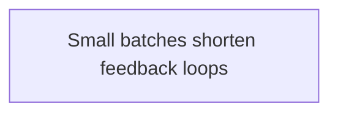

# Delivery

Tags: #delivery #moc #draft #private

## Scope

Reusable patterns for planning and learning from software delivery work.
Product configuration and one-off retrospective records belong elsewhere.

## Pattern map

This map shows the patterns currently in the delivery domain.

## Domain workflow

This workflow shows the current delivery pattern.

## Notes

- [Small batches shorten feedback loops](delivery-small-batches.md) — Decide when to divide work so each result can change the next step.
