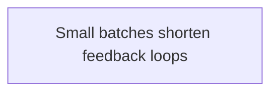

# Delivery

Tags: #delivery #moc #draft #private

## Scope

Reusable patterns for planning and learning from software delivery work.

## Pattern map

This map shows the current delivery pattern.

## Domain workflow

This workflow shows where the pattern currently applies.

## Notes

- [Small batches shorten feedback loops](delivery-small-batches.md) — Decide when to divide work so each result can change the next step.
