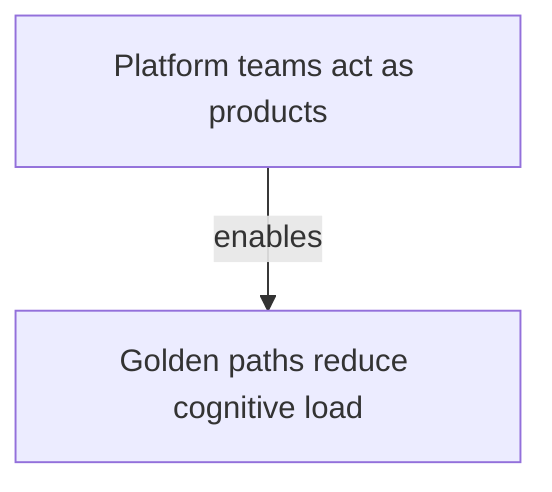

# Domain MOC design

## Decide whether a domain should exist

A domain deserves its own MOC when it gives a stable answer to:

> Would a reader expect to look here for this atomic pattern?

Create a separate domain when the scope, audience, or navigation purpose is meaningfully distinct. Do not create one merely because a source uses a new label.

Before creating a MOC:

1. Inspect existing MOC titles and scopes.
2. Identify overlap and likely ambiguity.
3. Prefer one clear home over duplicate navigation.
4. State why the proposed domain is useful.

## Define boundaries

A useful scope says both what belongs and what does not.

Weak:

> Notes about AI.

Stronger:

> Reusable ideas about how AI changes software engineering work and operating models. Product announcements and tool-specific setup instructions belong elsewhere.

Keep the scope stable enough to guide future notes without trying to predict every subtopic.

## Write navigation entries

Each entry combines an internal link with a short reason to open it. Use portable relative Markdown by default:

```markdown
- [Golden paths reduce cognitive load](ai-engineering-golden-paths-reduce-cognitive-load.md) — Why paved roads matter as AI increases change volume.
```

Do not use bare links, duplicate the atomic note, or link to a file that does not exist. If the domain has no notes, use `No atomic notes yet.` until the first note is created.

## Map the pattern system

The MOC owns the domain's system view. Its `Pattern map` shows every atomic pattern in the domain and the supported relationships between them. Its `Domain workflow` shows how those same patterns can be applied together without turning the MOC into a long-form guide.

Use each linked atomic note's exact H1 title in `Notes` and as its Mermaid node label in both diagrams. When using wiki links in `Notes`, provide that exact title as the alias. Clusters may orient the reader around stages, concerns, or decisions, but they must not imply unsupported relationships.

Atomic-note relationships are typed and directed. For a relationship declared by source note `S` that links target note `T`, use only these translations:

| Atomic type | Permitted MOC claim |
| --- | --- |
| `Prerequisite` | `S depends on T` or `T precedes S` |
| `Extension` | `S enables T`, `S informs T`, or `S complements T` |
| `Contrast` | `S contrasts with T` |
| `Example` | No pattern-to-pattern edge; use it only to clarify workflow context |

Do not reverse `Extension` or `Contrast` unless the other note declares its own relationship. Omit unsupported edges rather than making the map look complete.

The workflow may branch, converge, loop, or show a choice. It does not need to be a single linear sequence. When the workflow combines practices without an explicit atomic relationship, introduce it as domain-level synthesis in prose and avoid presenting the sequence as a source fact. If no defensible workflow exists, use `No supported domain workflow yet.` instead of inventing one.

Introduce the map with concise navigation prose, then use one fenced Mermaid `flowchart` per populated section:

````markdown
## Pattern map

The map shows the supported relationships between the domain patterns.


````

Every pattern still appears when no supported edges exist. The lack of an edge is more accurate than a decorative connection.

## Connect adjacent domains

Link another MOC only when the relationship improves navigation, and explain it:

```markdown
This domain intersects [Platform engineering](platform-engineering-moc.md) where AI-enabled delivery increases the need for paved roads and guardrails.
```

## Apply tags

Every MOC uses:

- one or more domain tags;
- `#moc`;
- exactly one workflow tag: `#draft`, `#review`, or `#publish`;
- exactly one visibility tag: `#private` or `#public`.

These conventions are plain Markdown text. If the selected PKM tool prefers wiki-style internal links, that syntax is also valid; do not otherwise introduce tool-specific metadata or query features.

## Review

Confirm:

- the domain does not duplicate an existing MOC;
- the scope guides inclusion and exclusion;
- every linked note exists and clearly belongs;
- every link has a navigation explanation;
- every note appears under the same title in the Pattern map and Domain workflow;
- map edges preserve supported relationship type and direction;
- the workflow is supported or clearly identified as synthesis;
- the tags support filtering and publishing workflow;
- the MOC remains navigation rather than becoming a long-form note.
