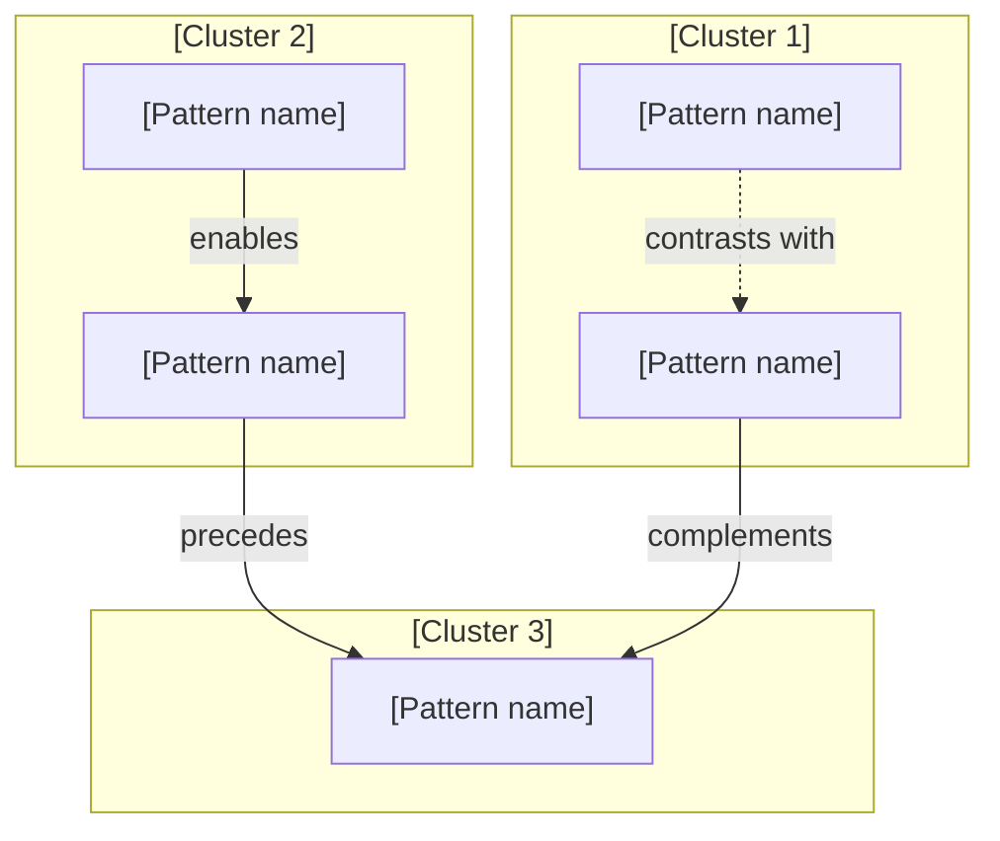

<!-- markdownlint-disable MD001 MD024 MD025 -->

<!--
INPUTS

Use:
- The domain MOC
- The MOC Pattern map and Domain workflow as the authoritative system view
- Atomic pattern notes
- Coaching companions

AUTHORING RULES

Patterns:
- Assign stable internal identifiers: P1, p2, p3, and so on.
- Give each pattern a short, memorable name.
- Present one pattern per slide.
- Do not show identifiers in slide titles or Mermaid nodes.
- Use identifiers only in H6 position metadata and when matching patterns to source notes.
- State the complete pattern in speaker notes:
  When X, do Y, because Z.

Slides:
- Keep slides concise and presentation-focused.
- Use H6 for lightweight metadata:
  p2 of 6 · Cluster name
- Show only signals, practices, comparisons, and diagrams.
- Prefer no more than six bullets on a slide.
- Use short pattern names throughout the visible deck.
- Use Mermaid for pattern maps and flows.
- Do not replace Mermaid diagrams with text maps.

Speaker notes:
- Move narrative and supporting metadata into speaker notes.
- For pattern slides, use this order:
  1. Pattern description
  2. Coach cue
  3. Related
  4. Source
- Include a Coach cue on every pattern slide.
- Link a coaching companion under Source only when one exists.
- Omit Related when no source-supported relationship exists.
- Also move domain questions, domain takeaways, selection rationale,
  evidence qualifiers, and remaining constraints into speaker notes.

Relationships:
- Preserve the MOC Pattern map topology in both deck maps.
- Preserve the MOC Domain workflow topology in the combined scenario.
- Show only relationships supported by source notes.
- Use:
  enables
  precedes
  informs
  complements
  contrasts with
  depends on
-->

# [Domain name]

## [One-line domain promise]

[Outcome this domain helps people achieve.]

<!--

Narrative:
[Why this domain matters and what the audience will learn.]

Domain question:
[What do these patterns collectively help answer?]

Source:
[Domain MOC](domain-moc.md)

Metadata:
Tags: #domain #slides #draft #private

-->

---

# Challenges & opportunities

## Challenges

- [Recurring challenge]
- [Practical consequence]
- [Limitation of the current approach]

## Opportunities

- [Potential improvement]
- [Capability the domain can enable]
- [Value of connecting the patterns]

<!--

Narrative:
[Explain the tension between the challenges and opportunities.]

Domain question:
[What do these patterns collectively help answer?]

Source:
[Domain MOC](domain-moc.md)

-->

---

# Pattern map



<!--

Narrative:
[Explain the clusters and the most important relationships.]

Domain question:
[What should the audience notice about the map?]

Related:
- [Pattern name] [relationship] [Pattern name]
- [Pattern name] [relationship] [Pattern name]
- [Pattern name] [relationship] [Pattern name]

Source:
[Domain MOC](domain-moc.md)

-->

---

<!--
PATTERN SLIDE

Duplicate this slide once for each pattern.
Replace the position, total, cluster, name, signals, practices, and notes.
-->

###### P[1] of [N] · [Cluster]

# [Short pattern name]

### Use when

- [Observable signal]
- [Recurring situation]

### Do

- [Concrete practice]
- [Concrete practice]
- [Optional concrete practice]

<!--

Pattern description:
When [condition], [action], because [mechanism].

Coach cue:
[Question that helps the audience discover or apply the pattern.]

Related:
[Short pattern name] ([relationship])

Source:
[Atomic pattern](domain-atomic-note.md)
[Coaching companion](domain-atomic-note.coach.md)

-->

---

<!-- Optional: use only when two patterns are genuine alternatives. -->

# Choosing between [pattern] and [pattern]

| Situation | Use |
| --- | --- |
| [Condition] | **[Short pattern name]** |
| [Condition] | **[Short pattern name]** |

<!--

Selection rule:
When [condition], prefer [pattern name], because [reason].

Coach cue:
Which observable condition distinguishes these choices?

Related:
[Pattern name] contrasts with [Pattern name]

Source:
[First atomic pattern](domain-atomic-note.md)
[Second atomic pattern](domain-atomic-note.md)

-->

---

# Apply the patterns together

## Scenario: [Realistic situation]

```mermaid
flowchart TD
    S["[Observed signal]"]
    A["[Pattern name]"]
    B["[Pattern name]"]
    C["[Pattern name]"]
    O["[Expected outcome]"]

    S --> A
    A -->|[relationship]| B
    B -->|[relationship]| C
    C --> O
```

- **Start with:** [First practice]
- **Then:** [Next practice]
- **Watch for:** [Constraint or failure condition]

<!--

Narrative:
[Explain why this sequence fits the scenario.]

Coach cue:
Where might this sequence branch or fail?

Related:
- [Pattern name] [relationship] [Pattern name]
- [Pattern name] [relationship] [Pattern name]

Source:
[Domain MOC](domain-moc.md)
[Relevant atomic pattern](domain-atomic-note.md)

-->

---

# What changes

| Before | Pattern | After |
| --- | --- | --- |
| [Current behaviour] | **[Pattern name]** | [Improved behaviour] |
| [Current behaviour] | **[Pattern name]** | [Improved behaviour] |
| [Current behaviour] | **[Pattern name]** | [Improved behaviour] |

<!--

Narrative:
[Explain the expected direction of change.]

Evidence:
[State whether these are measured results, observed outcomes,
hypotheses, or presentation synthesis.]

Coach cue:
Which change would provide the earliest useful evidence?

Remaining constraint:
[What these patterns do not solve.]

Source:
[Domain MOC](domain-moc.md)
[Relevant evidence or atomic notes](domain-atomic-note.md)

-->

---

# Pattern map revisited


<!--

Domain takeaway:
[Explain how the patterns work as a system.]

Coach cue:
Which relationship should the audience retain?

Related:
- [Pattern name] [relationship] [Pattern name]
- [Pattern name] [relationship] [Pattern name]
- [Pattern name] [relationship] [Pattern name]

Source:
[Domain MOC](domain-moc.md)

-->

---

# Choose one pattern to try

- **Signal:** [Something observable]
- **Pattern:** [Short pattern name]
- **Practice:** [One small action]
- **Review:** [How the result will be discussed]

<!--

Narrative:
Start with the pattern that addresses the clearest observable signal.
Apply one practice rather than adopting the entire system.

Coach cue:
What is the smallest action that could produce useful evidence?

Related:
[Pattern name] ([relationship, if applicable])

Source:
[Atomic pattern](domain-atomic-note.md)
[Coaching companion](domain-atomic-note.coach.md)

-->