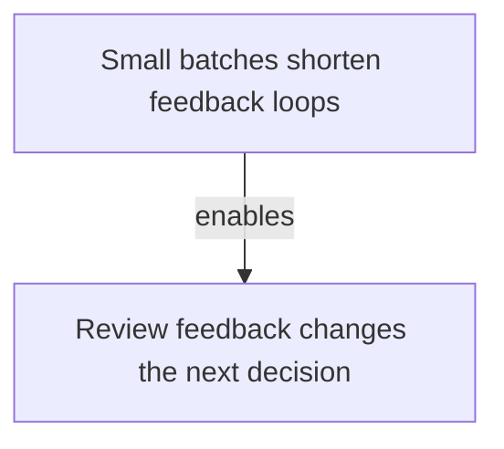

# Delivery

Tags: #delivery #moc #publish #private

## Scope

Reusable patterns for planning and learning from software delivery work.

## Pattern map

The map shows how a small reviewable batch enables useful feedback.

## Domain workflow

The workflow applies a small batch before reviewing what it changes.

## Notes

- [Small batches shorten feedback loops](delivery-small-batches.md) — Decide when to divide work so each result can change the next step.
- [Review feedback changes the next decision](delivery-review-feedback.md) — Decide when feedback arrives early enough to alter dependent work.
