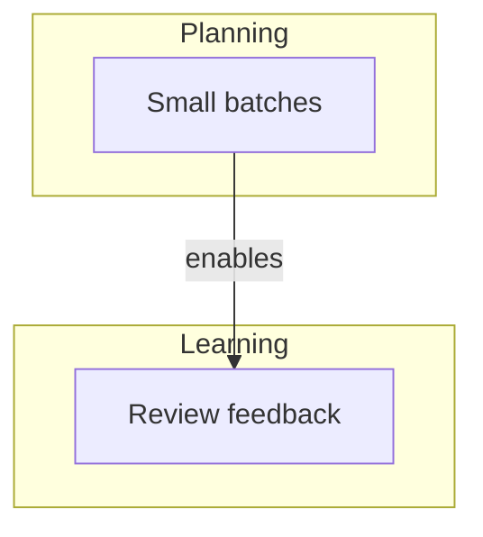
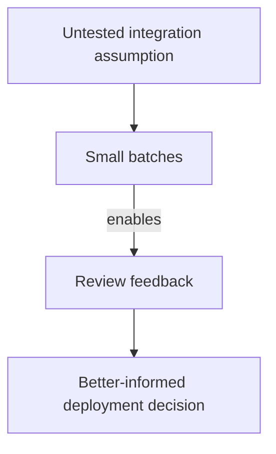

<!-- markdownlint-disable MD001 MD024 MD025 -->

# Delivery decisions

## Learn before dependent work removes the choice

Connect small reviewable results with feedback that changes the next decision.

<!--
Narrative:
Delivery plans improve when evidence arrives while dependent work can still change.

Domain question:
How can teams replace important assumptions before committing dependent work?

Source:
[Delivery](delivery-moc.md)

Metadata:
Tags: #delivery #slides #publish #private
-->

---

# Challenges & opportunities

## Challenges

- Plans depend on assumptions that have not been tested.
- Reviews happen after dependent work begins.

## Opportunities

- Small results expose uncertainty earlier.
- Timely feedback changes the next decision.

<!--
Narrative:
The opportunity is not smaller work for its own sake, but earlier learning that can alter the plan.

Domain question:
Which result would make the next delivery decision better informed?

Source:
[Delivery](delivery-moc.md)
-->

---

# Pattern map

<!--
Narrative:
A small result creates the opportunity for feedback before dependent work starts.

Domain question:
Which connection turns smaller packaging into a shorter learning loop?

Related:
- Small batches enables Review feedback

Source:
[Delivery](delivery-moc.md)
-->

---

###### p1 of 2 · Planning

# Small batches

### Use when

- The plan depends on an untested assumption.
- Later work would be expensive to revise.

### Do

- Define the smallest result that tests the assumption.
- Review it before dependent work begins.

<!--
Pattern description:
When uncertainty can change the plan, deliver a small reviewable batch, because each result improves the next decision.

Coach cue:
Which assumption could most change the current plan?

Related:
Review feedback (enables)

Source:
[Small batches shorten feedback loops](delivery-small-batches.md)
-->

---

###### p2 of 2 · Learning

# Review feedback

### Use when

- A review is scheduled after dependent work begins.
- Results are discussed without changing later decisions.

### Do

- Schedule review before committing dependent work.
- Record which decision the result can change.

<!--
Pattern description:
When a result tests a planning assumption, review it before dependent work starts, because feedback only shortens the loop while the next decision can still change.

Coach cue:
Which decision must remain open until this result is reviewed?

Source:
[Review feedback changes the next decision](delivery-review-feedback.md)
-->

---

# Apply the patterns together

## Scenario: A deployment plan depends on an untested integration assumption

- **Start with:** Isolate the smallest integration result.
- **Then:** Review it before dependent deployment work begins.
- **Watch for:** Coordination cost that exceeds the value of earlier learning.

<!--
Narrative:
The result matters because its review occurs while the deployment plan can still change.

Coach cue:
Where might this sequence branch or fail?

Related:
- Small batches enables Review feedback

Source:
[Delivery](delivery-moc.md)
[Small batches shorten feedback loops](delivery-small-batches.md)
[Review feedback changes the next decision](delivery-review-feedback.md)
-->

---

# What changes

| Before | Pattern | After |
| --- | --- | --- |
| Commit work around an assumption | **Small batches** | Test one reviewable result |
| Review after dependent work starts | **Review feedback** | Keep the next decision open |

<!--
Narrative:
The expected direction is earlier evidence and fewer decisions locked before review.

Evidence:
These are source-grounded expected directions, not measured results.

Coach cue:
Which change would provide the earliest useful evidence?

Remaining constraint:
Some work cannot be separated or paused safely.

Source:
[Delivery](delivery-moc.md)
[Small batches shorten feedback loops](delivery-small-batches.md)
[Review feedback changes the next decision](delivery-review-feedback.md)
-->

---

# Pattern map revisited

<!--
Domain takeaway:
Smaller batches shorten the loop only when review can change the next decision.

Coach cue:
Which relationship should the audience retain?

Related:
- Small batches enables Review feedback

Source:
[Delivery](delivery-moc.md)
-->

---

# Choose one pattern to try

- **Signal:** One assumption could change the deployment plan.
- **Pattern:** Small batches
- **Practice:** Define one reviewable integration result.
- **Review:** Discuss what the result changes before dependent work starts.

<!--
Narrative:
Start with the assumption that has the greatest effect on dependent work.

Coach cue:
What is the smallest action that could produce useful evidence?

Source:
[Small batches shorten feedback loops](delivery-small-batches.md)
-->
